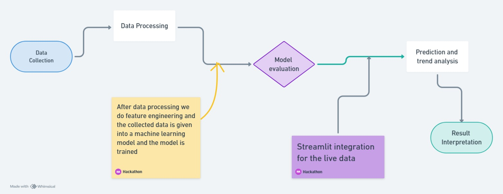
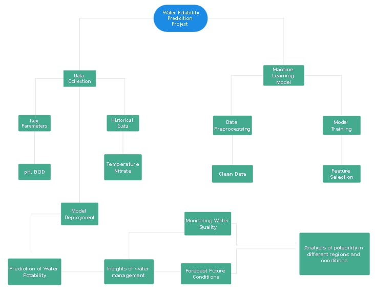

# Intro
Predicting river water potability is crucial for ensuring public health and environmental sustainability. This project focuses on developing a machine learning model that leverages key water quality parameters like pH, temperature, BOD, and nitrate levels. By analyzing historical and current data, the model aims to evaluate water quality and forecast trends, offering actionable insights for effective water resource management and pollution control.

# Workflow diagram

# Concept Map

# Tech Stack
## Frontend
* Streamlit
## AI Implementation
* sklearn

# Novelty
The uniqueness of this project stems from its innovative integration of machine learning with environmental data to predict the potability of river water by analyzing multiple critical water quality parameters such as pH, temperature, BOD, and nitrate levels. This approach moves beyond traditional methods of water quality assessment by utilizing advanced algorithms to analyze historical data, enabling the model to not only evaluate current water conditions but also predict future trends. This predictive capability empowers proactive water management, allowing stakeholders to identify potential risks and address contamination sources before they escalate. Additionally, the combination of real-time analysis with machine learning provides a robust, data-driven framework to support informed decision-making. By contributing to the maintenance of clean and safe water resources, this project plays a vital role in promoting long-term sustainability, protecting aquatic ecosystems, and ensuring public health.

# Solution
